# Task 1: Install MySQL server

# Task 2: Create database and table in your MySQL server

- Create a new database named website
  
  ```sql
  mysql> CREATE DATABASE website;
  ```
  
  

- Create a new table named member, in the website database
  
  ```sql
  mysql> CREATE TABLE member (
      -> id INT UNSIGNED PRIMARY KEY AUTO_INCREMENT,
      -> name VARCHAR(255) NOT NULL,
      -> email VARCHAR(255) NOT NULL,
      -> password VARCHAR(255) NOT NULL,
      -> follower_count INT UNSIGNED NOT NULL DEFAULT 0,
      -> time DATETIME NOT NULL DEFAULT CURRENT_TIMESTAMP);
  ```
  
  

# Task 3: SQL CRUD

- INSERT a new row to the member table where name, email and password must be set to test , test@test.com , and test . INSERT additional 4 rows with arbitrary data.
  
  ```sql
  mysql> INSERT INTO member(name, email, password)
      -> VALUES('test','test@test.com', 'test');
  ```
  
  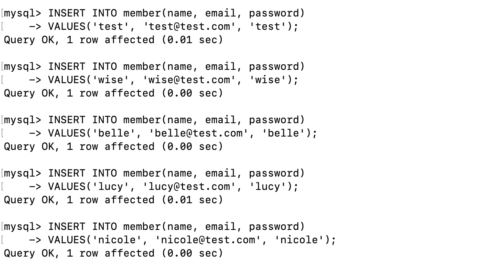

- SELECT all rows from the member table.
  
  ```sql
  mysql> SELECT * FROM member;
  ```
  
  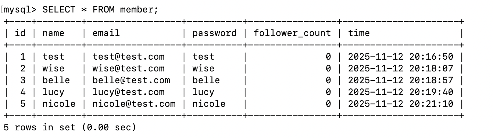

- SELECT all rows from the member table, in descending order of time.
  
  ```sql
  mysql> SELECT * FROM member ORDER BY time DESC;
  ```
  
  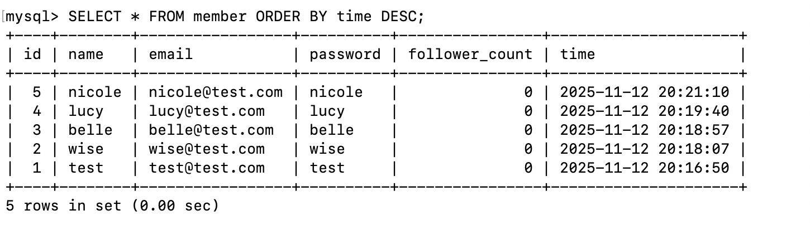

- SELECT total 3 rows, second to fourth, from the member table, in descending order

of time. Note: it does not mean SELECT rows where id are 2, 3, or 4.

```sql
mysql> SELECT * FROM member ORDER BY time DESC LIMIT 3 OFFSET 1;
```

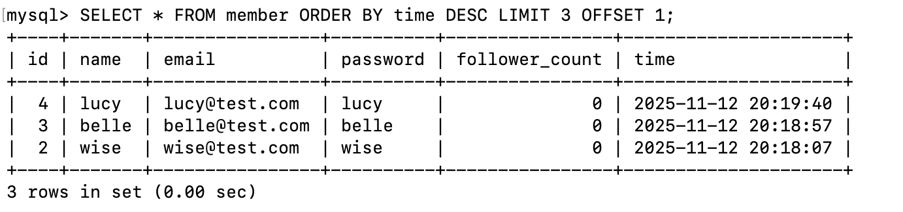

- SELECT rows where email equals to test@test.com .
  
  ```sql
  mysql> SELECT * FROM member WHERE email='test@test.com';
  ```
  
  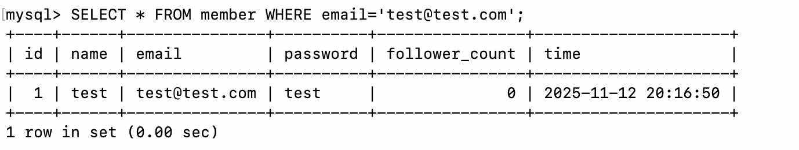

- SELECT rows where name includes the <u>es</u> keyword.
  
  ```sql
  mysql> SELECT * FROM member WHERE name LIKE '%es%';
  ```
  
  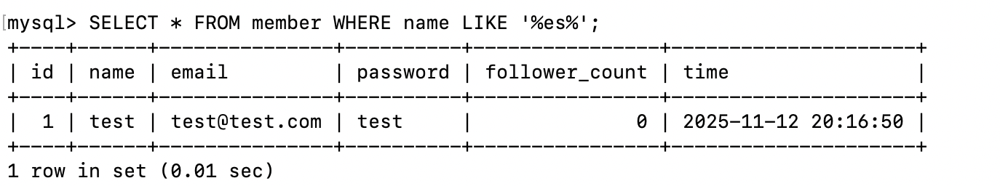

- SELECT rows where email equals to test@test.com and password equals to test .
  
  ```sql
  mysql> SELECT * FROM member 
      -> WHERE email='test@test.com'
      -> AND password='test';
  ```
  
  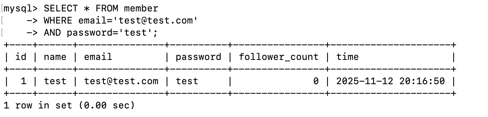

- UPDATE data in name column to test2 where email equals to test@test.com .
  
  ```sql
  mysql> UPDATE member
      -> SET name='test2'
      -> WHERE email='test@test.com';
  ```
  
  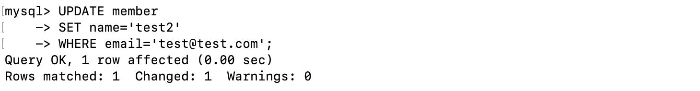

# Task 4: SQL Aggregation Functions

- SELECT how many rows from the member table.
  
  ```sql
  mysql> SELECT COUNT(*) FROM member;
  ```
  
  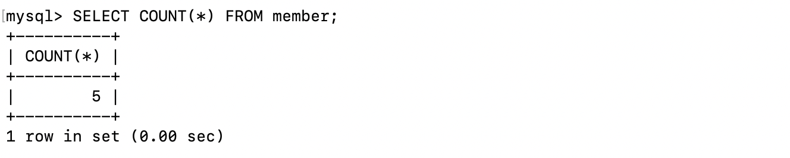

- SELECT the sum of follower count of all the rows from the member table.
  
  ```sql
  -- I've updated follower_count of a few members for this task.
  mysql> SELECT sum(follower_count) FROM member;
  ```
  
  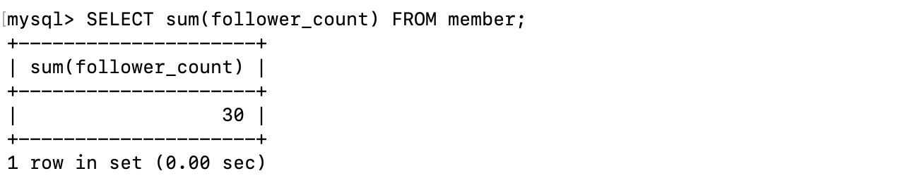

- SELECT the average of follower_count of all the rows from the member table.
  
  ```sql
  mysql> SELECT avg(follower_count) FROM member;
  ```
  
  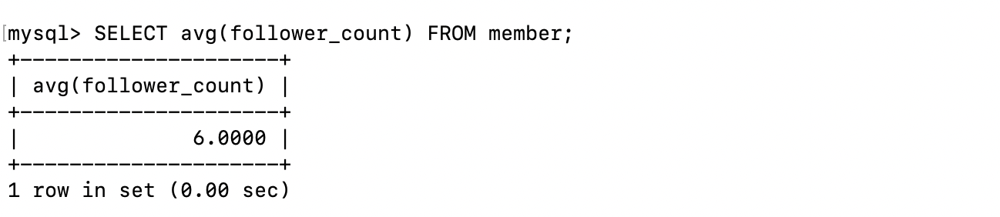

- SELECT the average of follower_count of the first 2 rows, in descending order of follower_count, from the member table.
  
  ```sql
  mysql> SELECT avg(first_two.follower_count)
      -> FROM (
      -> SELECT * FROM member
      -> ORDER BY follower_count DESC LIMIT 2) 
      -> AS first_two;
  ```
  
  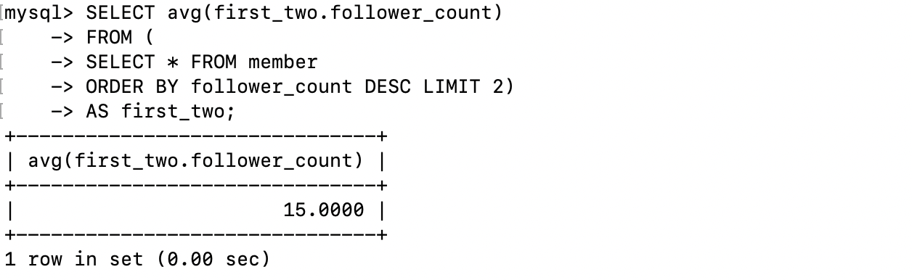

# Task 5: SQL JOIN

- Create a new table named message , in the website database.
  
  ```sql
  mysql> CREATE TABLE message (
      -> id INT UNSIGNED PRIMARY KEY AUTO_INCREMENT,
      -> member_id INT UNSIGNED NOT NULL,
      -> FOREIGN KEY (member_id) REFERENCES member(id),
      -> content TEXT NOT NULL,
      -> like_count INT UNSIGNED NOT NULL DEFAULT 0,
      -> time DATETIME NOT NULL DEFAULT CURRENT_TIMESTAMP);
  ```
  
  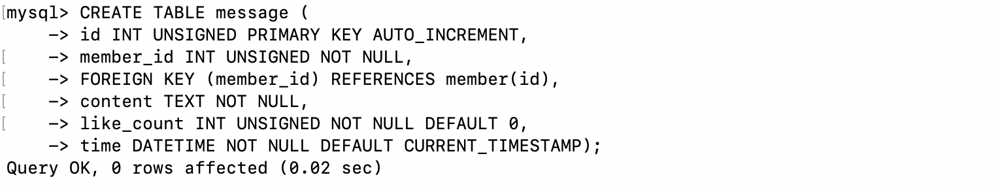

- SELECT all messages, including sender names. We have to JOIN the member table
  
  to get that.
  
  ```sql
  -- I've add a few messages for this task
  mysql> SELECT
      ->   message.*,
      ->   member.name AS sender
      -> FROM
      ->   message
      -> INNER JOIN
      ->   member
      -> ON
      ->   message.member_id=member.id;
  ```
  
  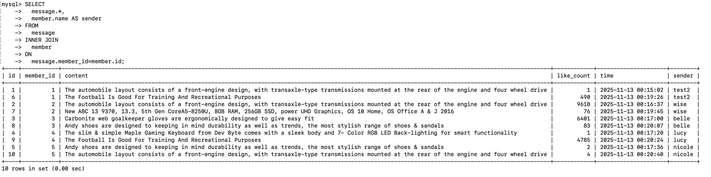

- SELECT all messages, including sender names, where sender email equals to
  
  test@test.com . We have to JOIN the member table to filter and get that.
  
  ```sql
  mysql> SELECT
      ->   message.*,
      ->   member.name AS sender
      -> FROM
      ->   message
      -> INNER JOIN
      ->   member
      -> ON 
      ->   message.member_id=member.id
      -> WHERE
      ->   member.email='test@test.com';
  ```
  
  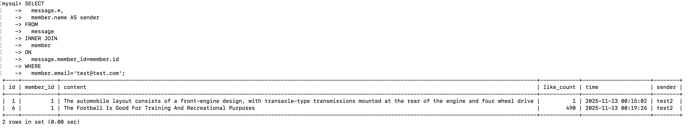

- Use SELECT, SQL Aggregation Functions with JOIN statement, get the average like
  
  count of messages where sender email equals to test@test.com .
  
  ```sql
  mysql> SELECT avg(test.like_count)
      -> FROM (
      -> SELECT like_count FROM message
      -> INNER JOIN member
      -> ON message.member_id=member.id
      -> WHERE member.email='test@test.com')
      -> AS test;
  ```
  
  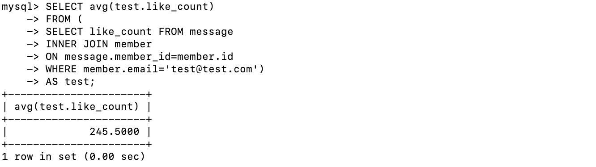

- Use SELECT, SQL Aggregation Functions with JOIN statement, get the average like
  
  count of messages GROUP BY sender email.
  
  ```sql
  mysql> SELECT
      ->   member.email,
      ->   avg(message.like_count)
      -> FROM
      ->   message
      -> INNER JOIN
      ->   member
      -> ON
      ->   message.member_id=member.id
      -> GROUP BY
      ->   member.email;
  ```
  
  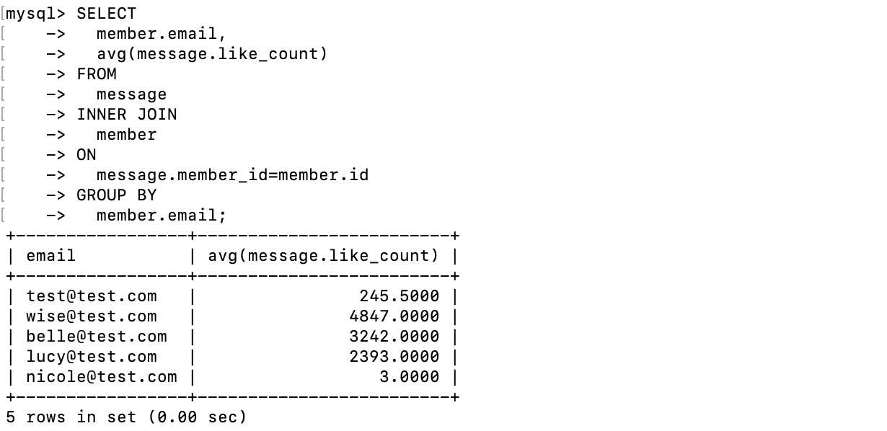
